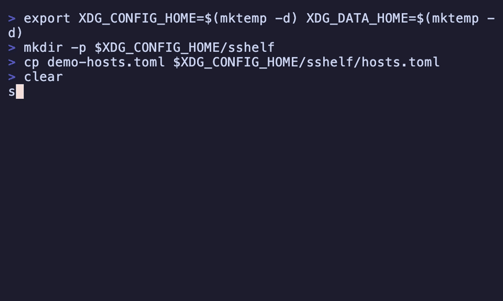

# sshelf

A fast terminal UI for managing and connecting to SSH hosts. Save each node once, then
fuzzy-search and connect in two keystrokes.



**`sshelf` keeps its own host database and generates the correct `ssh` command for you — it
never reads or edits `~/.ssh/config`** (except an explicit, read-only import). No more hunting
for the right `ssh -i … -J … user@host` invocation.

```
┌ sshelf  3/14 ───────────────────────────────────────┐
│ > prod                                               │
└──────────────────────────────────────────────────────┘
┌──────────────────────────────────────────────────────┐
│ ▸ prod-web    deploy@10.25.25.10:22      [prod,web]  │
│   prod-db     mike@10.25.25.25:5432      [prod,db]   │
│   prod-cache  mike@10.0.0.9:22           [prod]      │
└──────────────────────────────────────────────────────┘
 ↵ connect  ^a add  ^e edit  ^d del  ^y yank  ^o import  tag:NAME  F1 help  esc quit
```

## Why sshelf

Most SSH managers read or rewrite `~/.ssh/config`. `sshelf` deliberately doesn't: it maintains
an independent database, so it never risks corrupting a config shared with Ansible/Terraform/
your editor, and adds things plain SSH config can't express as nicely:

- **Atuin-style fuzzy launcher** — type to filter, `Enter` to connect.
- **Dual-pane file transfer** (`Ctrl-t`) — a two-pane browser to copy files and folders to and
  from a host over SFTP/SCP, with fuzzy search on both sides and live progress. It authenticates
  once (reusing the host's keys/agent or stored password) and never touches `~/.ssh/config`.
- **Guided add/edit form** — hostname, user, port, auth, jump hosts, tags, extra args.
- **Auto-supplied passwords** for password-auth hosts (via `SSH_ASKPASS`; no `sshpass`, the
  secret never appears in `ps`). Stored in your OS keyring, or an encrypted vault.
- **Jump hosts** (`ProxyJump`), **tags/groups** (`tag:prod`), and **frecency** ordering
  (most-used-recently float to the top).
- **Read-only import** from `~/.ssh/config` to get started.

## Install

macOS and Linux, on x86_64 and arm64. The prebuilt installs below need **no Rust toolchain**;
at runtime sshelf wants **OpenSSH 8.4+** (for password auto-supply).

**Homebrew** (macOS or Linux):

```sh
brew install max-rh/tap/sshelf
```

**Shell installer** (prebuilt binary, picks your platform):

```sh
curl --proto '=https' --tlsv1.2 -LsSf https://github.com/max-rh/sshelf/releases/latest/download/sshelf-installer.sh | sh
```

**Debian/Ubuntu** — grab the `.deb` for your architecture from the
[latest release](https://github.com/max-rh/sshelf/releases/latest), then:

```sh
sudo apt install ./sshelf_*_amd64.deb      # or *_arm64.deb
```

**From source** (needs **Rust 1.88+**):

```sh
cargo install --git https://github.com/max-rh/sshelf
```

> Linux uses a pure-Rust Secret Service backend (no `libdbus`/OpenSSL build deps).

> Shell tab-completion ships with every package. After installing, **open a new shell** (or
> `exec $SHELL`) so it loads — shells read completions once, at startup.

## Usage

```sh
sshelf                       # launch the TUI
sshelf <host>                # connect straight to a saved host by name (skips the TUI)
sshelf print-command <host>  # print the generated ssh command without connecting
sshelf list                  # print saved hosts
sshelf list <query>          # filter the list: fuzzy text and/or tag:NAME (e.g. tag:prod)
sshelf --config FILE         # use a specific config file (also: $SSHELF_CONFIG)
sshelf --transfer-log FILE   # log transfer ssh/sftp commands + errors to FILE (debugging)
sshelf import [--dry-run]    # read-only import from ~/.ssh/config
echo "$PASS" | sshelf set-password <name>   # store a password (scriptable / headless)
```

**Keys:** type to filter · `tag:NAME` to filter by tag · `↑/↓` move · `Enter` connect ·
`Ctrl-a` add · `Ctrl-e` edit · `Ctrl-d` delete · `Ctrl-y` yank the `ssh` command · `Ctrl-t`
transfer files · `Ctrl-o` import · `F1` help · `F2` settings · `Esc`/`Ctrl-c` quit.

In the **add/edit** form the Key field picks an identity: `←/→` cycles keys found in `~/.ssh`
(including `.pem`), and `Enter` opens a file browser (type to fuzzy-filter) to choose a key
anywhere. **F2** opens settings (config & hosts-file locations).

On connect, `sshelf` hands the terminal to `ssh` (it `exec`s into it); when the session ends
you're back at your shell.

## Configuration

`~/.config/sshelf/config.toml` (written with comments on first run):

| Key | Default | Meaning |
|---|---|---|
| `decay_rate` | `0.2` | Frecency decay per day (higher = recency matters more). |
| `default_sort` | `"frecency"` | Idle list order: `"frecency"` or `"name"`. |
| `accent` | `"cyan"` | UI accent color. |
| `hosts_file` | (config dir) | Custom host-database path. Editable via **F2** settings; `~` is expanded. |

Point sshelf at an alternate config with `--config FILE` or `$SSHELF_CONFIG` (the config-file
location itself isn't stored in the config — that'd be circular). The hosts-file location *is*
a setting, editable from the **F2** settings screen.

Data lives under XDG dirs: hosts in `~/.config/sshelf/hosts.toml` (human-readable),
usage state in `~/.local/share/sshelf/`.

## Passwords & security

Prefer SSH keys / agent where you can. For password-auth hosts, `sshelf` stores the secret in
your **OS keyring** by default (macOS Keychain, Linux Secret Service). On headless systems with
no keyring, set `SSHELF_VAULT_PASSPHRASE` to use an **age-encrypted vault** instead. Passwords
are never written to `hosts.toml` and never passed on the command line. See
[`SECURITY.md`](SECURITY.md) for the full threat model.

## Support

If sshelf is useful to you, a Bitcoin tip is appreciated (entirely optional):

[](bitcoin:bc1qcdeyhpwq76u97dhymx876n49uq85z4y3ccrpje)

**Bitcoin:** `bc1qcdeyhpwq76u97dhymx876n49uq85z4y3ccrpje`

## License

Dual-licensed under either [MIT](LICENSE-MIT) or [Apache-2.0](LICENSE-APACHE), at your option —
the Rust-ecosystem norm.

## Documentation

Architecture, data model, and design decisions live in [`docs/`](docs/index.md).
