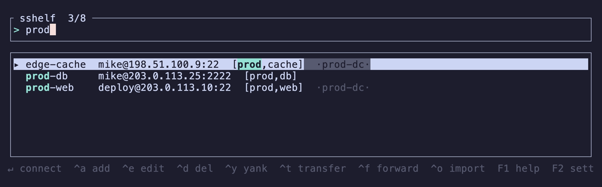
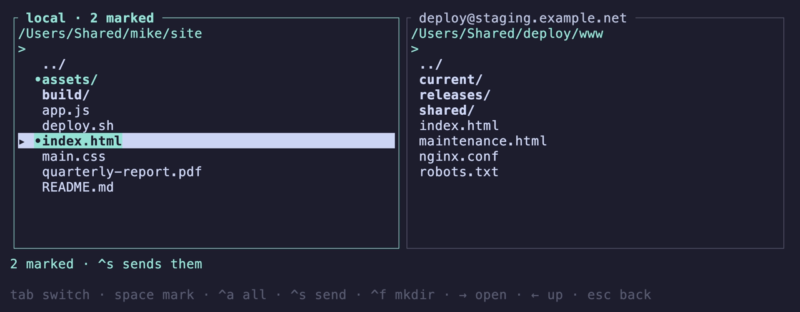
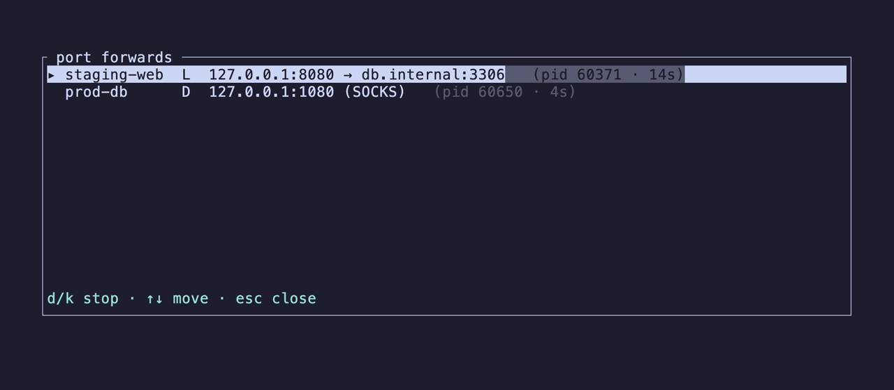
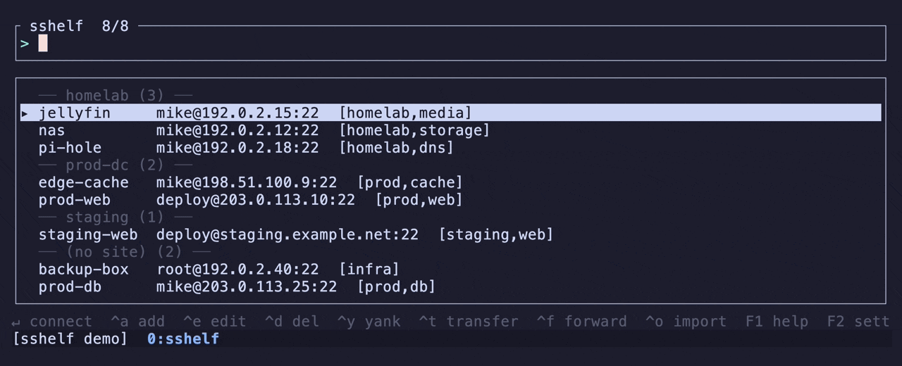
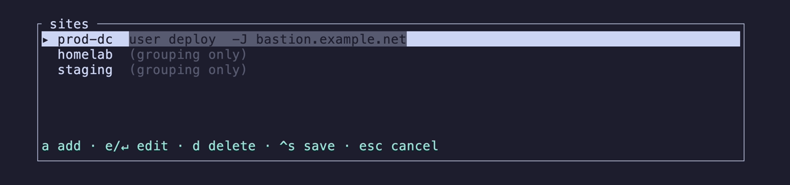
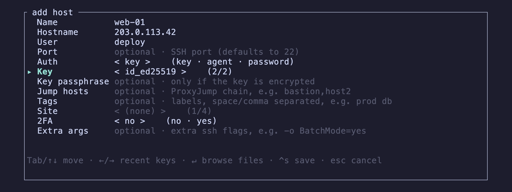
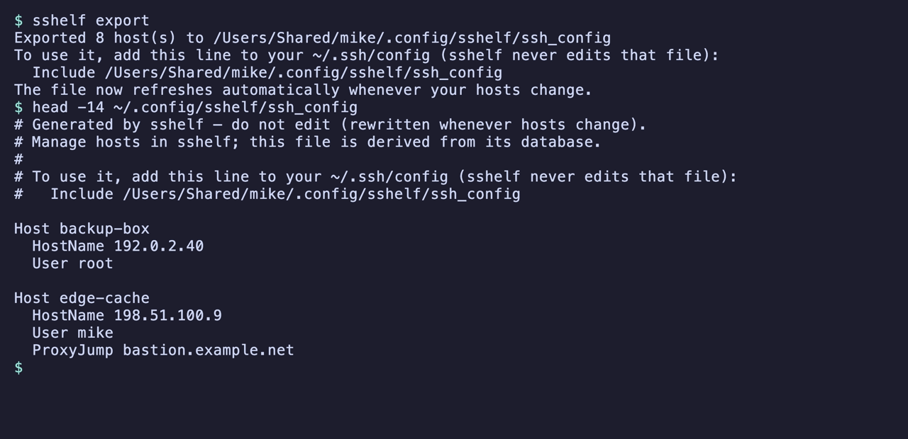
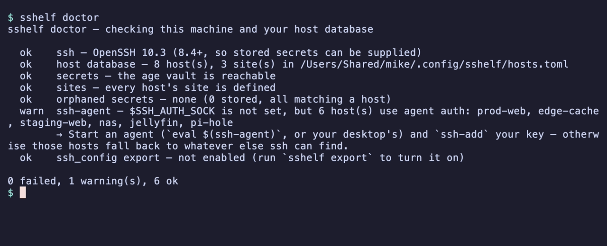

# sshelf

**Fuzzy-search your SSH hosts and connect in two keystrokes.**

sshelf keeps its own host list, builds the `ssh` command for you, and then gets out of the
way. It hands the terminal to real OpenSSH and never touches `~/.ssh/config`.

[](https://crates.io/crates/sshelf)
[](https://github.com/max-rh/sshelf/actions/workflows/ci.yml)
[](https://max-rh.github.io/sshelf/)
[](https://ratatui.rs/)
[](#install)
[](#license)


## Install

macOS and Linux, x86_64 and arm64. The prebuilt packages need no Rust toolchain. At runtime
sshelf wants **OpenSSH 8.4+**, which is where password auto-supply comes from.

**Homebrew** (macOS or Linux):

```sh
brew install max-rh/tap/sshelf
```

**Shell installer** (prebuilt binary, picks your platform):

```sh
curl --proto '=https' --tlsv1.2 -LsSf https://github.com/max-rh/sshelf/releases/latest/download/sshelf-installer.sh | sh
```

<details>
<summary><b>More options</b> (Debian/Ubuntu · Fedora/RHEL · Gentoo · cargo)</summary>

**Debian/Ubuntu**: grab the `.deb` from the
[latest release](https://github.com/max-rh/sshelf/releases/latest), then
`sudo apt install ./sshelf_*_amd64.deb` (or `*_arm64.deb`).

**Fedora / RHEL / Rocky / openSUSE**: grab the `.rpm` (static build, works on any RPM
distro) from the [latest release](https://github.com/max-rh/sshelf/releases/latest), then
`sudo dnf install ./sshelf-*.x86_64.rpm` (or `.aarch64.rpm`).

**Gentoo**: community-maintained overlay (unofficial, thanks to @masterwolf-git). Run
`eselect repository enable masterwolf && emerge --sync && emerge --ask app-admin/sshelf`.

**Cargo** (from [crates.io](https://crates.io/crates/sshelf); needs Rust 1.88+):
`cargo install sshelf`.

Shell tab-completion ships with every package. Open a new shell after installing. On Linux,
secrets use a pure-Rust Secret Service backend (no `libdbus`/OpenSSL build deps).

</details>

Full details and completions setup: **[Install guide](https://max-rh.github.io/sshelf/install.html)**.

## Why I built this

I run a couple of dozen machines (a homelab, some VPSes, a few boxes behind a bastion), and
I kept typing `ssh -J bastion -i ~/.ssh/some-key -p 2222 user@host` from memory or grepping my
shell history for it. Every SSH manager I tried wanted either to own `~/.ssh/config` or to
give me an account and sync my hosts through someone's server. I didn't want either. I wanted
a launcher that keeps its own list, builds the command, and gets out of the way. And a place
to keep the passwords for the handful of hosts that can't use keys, without ever putting them
in a file. So I built it.

## What you get

### Fuzzy launcher

Type to filter. `Enter` connects. Your most-used hosts float to the top on their own
(frecency: usage count, decayed by recency), and `tag:prod` / `site:homelab` narrow the list
further. `Ctrl-y` copies the command it built instead of running it. From the shell,
`sshelf prod-web` connects by name and `sshelf -` reconnects to the last host, both without
opening the TUI.



### It `exec()`s into your `ssh`

sshelf builds the argv from the host record, tears its own UI down, and then *replaces itself*
with OpenSSH. There is no wrapper between you and the session: a real TTY, your `ssh`, your
config-free flags. When the session ends you're back at your shell, not in a menu. The
command it runs is exactly the one `Ctrl-y` shows you.
[How the command is built](https://max-rh.github.io/sshelf/ssh-command.html).

### Dual-pane file transfer

`Ctrl-t` opens your files on the left and the host's on the right, over a single authenticated
connection. `Space` marks, `Ctrl-a` marks everything the filter shows, `Ctrl-s` sends the
whole set either way, `F7` makes a directory. A name the destination already has is skipped,
never overwritten.



### Background port forwards

`Ctrl-f` opens a Local, Remote, or SOCKS tunnel that keeps running after you quit sshelf,
and after you close the terminal. `F4` lists every one of them across all hosts and stops the
one you pick. They're tracked by pid and reconciled against the processes that are really
running, so nothing lingers in a list after it dies. No daemon, no supervisor.



### tmux mode

Set `tmux = "window"` or `"pane"` and `Enter` opens the host in a new tmux window (named after
the host) or a new pane instead of replacing sshelf. End the session and the picker is still
sitting there, still running.



### Sites and tags

`F3` manages sites: a site groups hosts and can carry a shared bastion, user, port, and key
that its members inherit at connect time, filling in only the fields a host leaves unset. Tags
are free-form labels you filter on. Both show up in the list, and an inherited bastion shows
up in the command sshelf builds.



### Passwords without `sshpass`

For the hosts that can't use keys, sshelf stores the password in your OS keyring (or an
`age`-encrypted vault on a headless box) and supplies it through `SSH_ASKPASS` when ssh asks.
It answers only prompts with the shape of a real password or passphrase prompt, so a server
can't phish the secret with look-alike text. The password is never in a file, never in `ps`,
never on a command line. Hosts that also want a verification code get a prompt for it before
the connection starts. [Passwords, keys & 2FA](https://max-rh.github.io/sshelf/passwords-2fa.html)
· [Security](https://max-rh.github.io/sshelf/security.html).



### Export to ssh_config

`sshelf export` writes one ssh_config fragment of its own and gives you a single `Include`
line to paste into `~/.ssh/config` yourself. After that, plain `ssh`, `scp`, `rsync`, `git`, and anything
that reads SSH config (VS Code Remote-SSH, JetBrains Gateway) resolve your sshelf hosts by
name, bastion and all. The file refreshes whenever your hosts change. sshelf still writes
nothing under `~/.ssh`.



### Import what you already have

`sshelf import` reads `~/.ssh/config`, strictly read-only, and copies over the hosts it can
model. `sshelf import --tailscale` runs your own `tailscale` CLI and turns your tailnet into
searchable hosts, with MagicDNS names, the tailnet as a site, and ACL tags as tags. Both are
add-only, so re-running one is always safe, and neither happens unless you ask for it.

### `sshelf doctor`

One command for when something isn't working. It checks your OpenSSH version, whether the
secret backend actually opens, whether `hosts.toml` parses, hosts pointing at a site that
doesn't exist, a missing agent socket, and an export that has drifted. It names the fix for
each. Read-only, exits 1 if anything failed, and it never contacts a host.



## How it compares

Compiled in September 2026 from each project's own README (and, for Termius, its site). A cell
reading "not stated" means the project's own docs don't say.

| | [sshelf](https://github.com/max-rh/sshelf) | [purple](https://github.com/erickochen/purple) | [omnyssh](https://github.com/timhartmann7/omnyssh) | [Voltius](https://github.com/VoltiusApp/voltius) | [Termius](https://termius.com/) |
|---|---|---|---|---|---|
| Runs in | terminal (TUI) | terminal (TUI) | terminal (TUI) + desktop app | desktop app (Tauri) | desktop + mobile app |
| Edits `~/.ssh/config` | never | yes, in place | no, reads it at startup | n/a (own store) | n/a (own store) |
| Account required | no | no | no | for real-time sync | yes |
| Holds tokens for other services | no | yes, one per cloud provider | no | yes, for sync | not stated |
| Network calls of its own | none | cloud provider sync | host metrics polling | sync, updates, host metrics | sync |
| Secrets custody | your OS keyring / `age` vault | keyring + password managers | not stated | its E2EE vault | its encrypted vault |
| Connect | `exec()` into your `ssh` | runs your `ssh` command | built-in terminal | built-in terminal | built-in terminal |
| Port forwards | yes, survive quitting | yes, live monitoring | not stated | yes | yes |
| File transfer | dual-pane SFTP | split-pane | two-panel SFTP | dual-pane, drag & drop | SFTP |
| Containers / metrics dashboards | no | yes | yes | yes | not stated |
| Team sharing | no | no | no | paid tiers | paid tiers |
| Platforms | macOS, Linux | macOS, Linux | macOS, Linux, Windows, Termux | Windows, macOS, Linux | macOS, Windows, Linux, iOS, Android |
| License | MIT / Apache-2.0 | MIT | Apache-2.0 | AGPL-3.0 | proprietary |

sshelf has no dashboards, no container management, no team sharing, and no Windows build. The
first three are choices, and [`PRIVACY.md`](PRIVACY.md) explains why: each one would mean
sshelf holding something of yours, or talking to something on its own.

## What it will never do

- No telemetry. No analytics, no crash reports, no update check.
- No account, no cloud, no sync server. There is nothing to sign up for.
- No tokens held. sshelf never stores a cloud or API credential.
- No network calls of its own. The only traffic is the SSH session you asked for.
- Never edits `~/.ssh/config`, and never writes anything under `~/.ssh`.
- No secrets in `hosts.toml`. That file is safe to commit and share.
- No Electron. One binary, about four megabytes.

[`PRIVACY.md`](PRIVACY.md) says what it reads, writes, runs, and sends.
[`SECURITY.md`](SECURITY.md) is the threat model for stored secrets.

## First five minutes

```sh
sshelf                        # launch the TUI (Ctrl-a adds your first host)
sshelf import --dry-run       # preview a read-only import from ~/.ssh/config
sshelf import                 # ...do it
sshelf import --tailscale     # ...or import your whole Tailscale tailnet
sshelf prod-web               # connect straight to a saved host (skips the TUI)
sshelf -                      # reconnect to the most recently used host
sshelf list tag:prod --json   # scriptable listing (fields + the ssh command)
sshelf print-command db       # print the ssh command instead of running it
sshelf export                 # Include file so plain ssh/scp/VS Code see your hosts
sshelf doctor                 # something not working? check the setup and get told the fix
```

In the TUI: type to filter (plus `tag:NAME` / `site:NAME`) and `Enter` to connect.
`F1` shows every key.

## Documentation

The **[user guide](https://max-rh.github.io/sshelf/)** covers everything:
[Quickstart](https://max-rh.github.io/sshelf/quickstart.html) ·
[CLI reference](https://max-rh.github.io/sshelf/cli.html) ·
[Configuration](https://max-rh.github.io/sshelf/configuration.html) ·
[FAQ](https://max-rh.github.io/sshelf/faq.html) ·
[`sshelf doctor`](https://max-rh.github.io/sshelf/doctor.html).
There are per-feature pages for [file transfer](https://max-rh.github.io/sshelf/transfer.html),
[port forwarding](https://max-rh.github.io/sshelf/port-forwarding.html),
[sites & tags](https://max-rh.github.io/sshelf/sites-tags.html),
[passwords & 2FA](https://max-rh.github.io/sshelf/passwords-2fa.html), and
[SSH-config export](https://max-rh.github.io/sshelf/export.html).
Architecture and design decisions live in [`docs/`](docs/index.md), and there's an
[`llms.txt`](https://max-rh.github.io/sshelf/llms.txt) for the machines.

## Questions & ideas

Ask, suggest a feature, or show what you built with it in
[**GitHub Discussions**](https://github.com/max-rh/sshelf/discussions). Contributions are
welcome. Start with [`CONTRIBUTING.md`](CONTRIBUTING.md).

## Support

If sshelf is useful to you, a Bitcoin tip is appreciated (entirely optional):

[](bitcoin:bc1qcdeyhpwq76u97dhymx876n49uq85z4y3ccrpje)

**Bitcoin:** `bc1qcdeyhpwq76u97dhymx876n49uq85z4y3ccrpje`

## License

Dual-licensed under either [MIT](LICENSE-MIT) or [Apache-2.0](LICENSE-APACHE), at your option (the
Rust-ecosystem norm).
